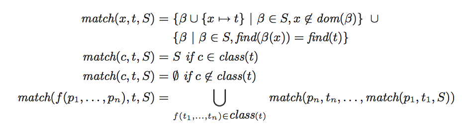
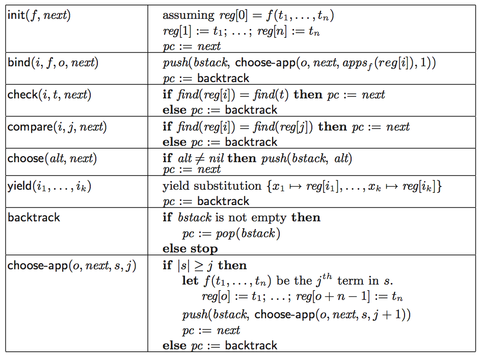
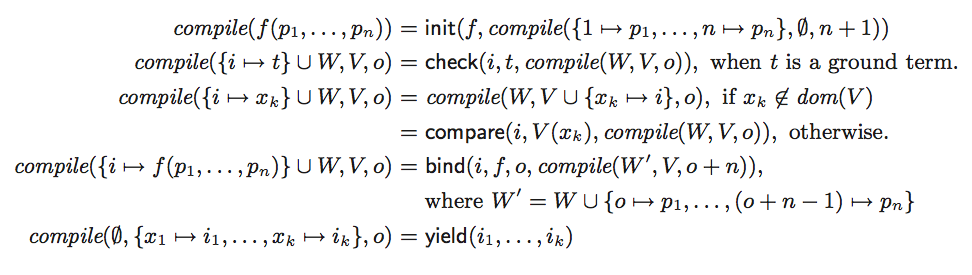
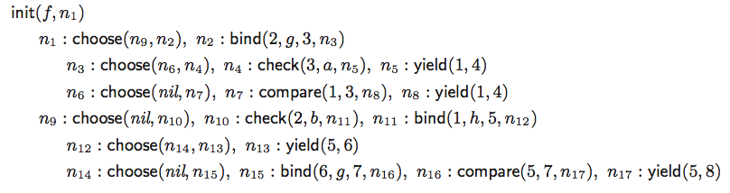
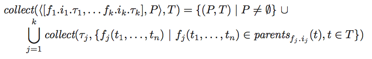

## Quantifier reasoning

### Motivation

Program verification problems often require dealing with quantified subformulas. [@fun]

## Quantifier reasoning

$$P(f(42)) \wedge \forall x. P(f(x))) \Rightarrow x < 0$$

\pause

\begin{center}
\emph{Instantiate $P(f(x))$ with the substitution $[x := 42]$}
$$P(f(42)) \wedge (\forall x. P(f(x))) \Rightarrow x < 0) \wedge (P(f(42)) \Rightarrow 42 < 0)$$
\end{center}
\pause
\begin{center}
\emph{Apply Modus Ponens}
$$42 < 0$$
\end{center}

## Quantifier reasoning

### Problem 1

How to figure out which instances are going to be useful?

\pause

### Solution

Identify subterms occurring in the quantified formula (*patterns*), and only add instances that make those subterms equal to ground subterms that are currently being considered in the proof.

\pause

### Example

In the previous example, one such pattern is $P(f(x))$, which when instantiated with $[x := 42]$, yields its corresponding ground subterm $P(f(42))$.

## Quantifier reasoning

### Problem 2

Syntactic equality is oftentimes not enough. Consider eg. the following proposition:
$$a = f(42) \wedge P(a) \wedge \forall x. P(f(x))) \Rightarrow x < 0$$
There are no instances of $P(f(x))$ that matches the ground term $P(a)$, ie. there is no substitution for $x$ that make $P(f(x))$ syntactically equal to $P(a)$.

\pause

### Solution

Use the congruence closure of the equality relation induced by the current context.

For example, in the context $P(a), a = f(42)$, the substitution $[x := 42]$ makes $P(f(x))$ equal to $P(a)$, since $P(a) \simeq P(f(42))$.

## Quantifier reasoning

### Problem 3

How to identify the set of patterns for a given formula?

\pause

### Solution

* Heuristics
* Ask the user to provide the patterns

## Quantifier reasoning

### Problem 4

How to identify the substitutions that make the pattern equal to some ground term?

\pause

### Solution

Apply an E-matching algorithm.

## E-Matching algorithm (overview)

### Input

* A binary relation $E$ over terms
* A ground term $t$
* A pattern $p$

### Output

The set of substitutions $\theta$, modulo $E$, over the variables in $p$, such that $$E \vDash t \simeq \theta(p)$$

## E-matching algorithm

### Definitions

* $\Sigma$ is set of function symbols, called the *signature*
* $V$ is the set of variables
* Each function symbol $f$ has an arity, $arity(f)$
* An $f$-application is a term of the form $f(t_1,\ldots,t_n)$
* $T(\Sigma, V)$ is the set of terms
* $T(\Sigma, \varnothing)$ is the set of ground terms
* The set of non ground terms is called *patterns*
* A substitution $\beta$ is a mapping from variables to ground terms
* A binary relation $E$ over $T(\Sigma, \varnothing)$

## E-graph

* An *E-graph* is a data-structure which maintains the *congruence closure* of a binary relation $E = \{(t_1, t'_1), (t_2, t'_2), \ldots\}$.
* This binary relation is given incrementally with the $union(t_1, t'_1)$ operation.
* Each equivalence class generated by the congruence relation has a *representative*.

## E-graph

### Operations

For each term $t$ in the *E-graph*:

* $find(t)$ denotes the representative of the equivalence class that contains $t$
* $class(t)$ denotes the equivalence class that contains $t$
* $parents(f)$ denotes the set of terms $f(\ldots,t',\ldots)$ in the E-graph such that $t' \simeq t$
* $parents_f(t)$ is a subset of $parents(t)$ which contains only $f$-applications
* $parents_{f.i}(t)$ is a subset of $parents_f(t)$ which contains only $f$-applications where the $i$-th argument $t_i$ is s.t. $t_i \simeq t$
* \ldots
<!---
* $apps_f(t)$ denotes the set of terms $f(t_1,\ldots,t_n)$ such that $f(t_t,\ldots,t_n) \simeq t$
* $apps(f)$ denotes the set of all $f$-applications in the E-graph
-->

<!---
Each equivalence class representative $t$ is associated with two approximated sets of function symbols:

* $funs(t)$ is the (approximated) set of function symbols in $class(t)$
* $pfuns(t)$ is the (approximated) set of functions symbols in $parents(t)$
-->

## Quantifier reasoning with E-matching

* Semantically, the formula $$\forall x_1, \ldots , x_n. F$$ is equivalent to $$\bigcup_{\beta} \beta(F)$$ where $\beta$ ranges over all substitutions over the $x$'s.

\pause

* We now want to select from this set, the substitutions that are relevant to the conjecture.

\pause

* To do so, we select non ground terms $p$ from $F$ as *patterns*, and consider $\beta(F)$ to be relevant whenever $\beta(p)$ is in the *E-graph.*

## E-matching algorithm

{ width=100% }
\pause

The abstract matching procedure returns all substitutions that E-match a pattern $p$ with term $t$.
That is, if $\beta \in match(p, t, \varnothing)$ then $E \vDash \beta(p) = t$.

<!--- The set of relevant substitutions for a pattern $p$ can be obtained by taking $\bigcup_{t \in \text{E-graph}} match(p, t, \varnothing)$ -->

## Efficient E-matching

### Complexity

E-matching is in theory NP-hard, and the number of matches can be exponential in the size of the E-graph.

### In practice

The cost is dominated by:

* Matching a set of patterns against terms
* Compute sets of patterns that can generate new matches

### Solution

Compile patterns into code, and introduce further optimizations.

## E-matching abstract machine

### Memory

* register $pc$ for storing the current instruction
* an array of registers $reg[]$ for storing ground terms
* a stack $bstack$ for backtracking

## E-matching abstract machine

### Instructions

* init
* *bind*
* check
* compare
* choose
* *yield*
* *backtrack*
* choose-app

## Semantics

{ width=100% }

## Example

The pattern

$$f(x_1,g(x_1,a),h(x_2),b)$$

is compiled to into the following *labeled instructions*:

| Label | Instruction                  |
| ----- | ---------------------------- |
| $n_0$ | $\textsf{init}(f,n_1)$       |
| $n_1$ | $\textsf{check}(4,b,n_2)$    |
| $n_2$ | $\textsf{bind}(2,g,5,n_3)$   |
| $n_3$ | $\textsf{compare}(1,5,n_4),$ |
| $n_4$ | $\textsf{check}(6,a,n_5)$    |
| $n_5$ | $\textsf{bind}(3,h,7,n_6)$   |
| $n_6$ | $\textsf{yield}(1,7)$        |

## E-matching abstract machine

### Usage

To compute $match(p, t, \varnothing)$, where $p$ is eg. the pattern on the previous slide:

* Store $t$ in $reg[0]$
* Set $pc = n_0$
* Execute the instruction stored in $pc$
* Collect the yielded substitutions

<!-- { width=100% } -->

## Efficient E-matching

To further improve efficiency, the paper introduces two novel techniques:

* E-matching code trees
* Inverted path index

## E-matching code trees

### Problem

Oftentimes, patterns have some shared structure, and the solver wastes time repeatedly matching against these subpatterns.

### Example

* $f(x,g(a,y))$
* $f(x,g(x,y))$
* $f(h(x,y),b)$
* $f(h(x,g(x,y)),b)$

## E-matching code trees

### Solution

* Minimize the time spent on matching similar patterns by combining their code sequences in a *code tree*
* The matching work common to multiple patterns is *factored out*
* Whenever the DPLL(T) engine asserts a quantified formula, add its patterns to the code tree. Remove them when the engine backtracks.

## E-matching code trees

$$P = \{f(x,g(a,y)), f(x,g(x,y)), f(h(x,y),b), f(h(x,g(x,y)),b)\}$$

\begin{figure}
\hspace*{\fill}
\begin{tikzpicture}[level distance=50]
\Tree [.$f(\ph,\ph)$
	[.$(x,g(\ph,\ph))$
		$(a,y)$
		$(x,y)$
	]
	[.$(h(x,\ph),b)$
		$y$
		$g(x,y)$
	]
]
\end{tikzpicture}
\hspace*{\fill}
\caption{Code tree for $P$}
\end{figure}

## E-matching code trees

$$P = \{f(x,g(a,y)), f(x,g(x,y)), f(h(x,y),b), f(h(x,g(x,y)),b)\}$$

{ width=100% }

## Incrementality

* Say we have a term $f(a, b)$, and a pattern $f(g(x), y)$
* At this stage, there is no way to instantiate $f(g(x), y)$ so that it matches $f(a, b)$
* At some point, the operation $union(a, g(c))$ is executed
* The E-graph now tells us that $f(a, b) \simeq f(g(c), b)$
* It thus becomes possible to instantiate $f(g(x), y)$ with $[x := c, y := b]$ to match $f(g(c), b)$.

## Incrementality

### Problem

How to identify new terms and patterns that become relevant for matching?

\pause

### Solution

Introduce an *inverted path index*.

## Inverted path index

### pc-pair

A pair of function symbols $(f,g)$ is a *parent-child* pair (*pc-pair*) of a pattern $p$, if $p$ contains a term of the form:

$$f(\ldots,g(\ldots),\ldots)$$

## Inverted path index

### Inverted path string

An *inverted path string* over a signature $\Sigma$ is either:

* the empty string $\epsilon$
* $f.i.\pi$, where $\pi$ is an inverted path string, $f \in \Sigma$, and $i \in i\mathbb{N}$.

## Inverted path index

### Inverted path string

The inverted path string $g.1.f.2$ is a path to term $f(a,g(h(x),c))$ from subterm $h(x)$.

\begin{figure}
\hspace*{\fill}
\begin{tikzpicture}[
   level distance=1.25cm,sibling distance=.5cm, 
   edge from parent/.append style={<-,>=latex}]
\Tree [.$f(\ph,\ph)$
    \edge node[auto=right, pos=.55] {$f.1$}; [.$a$ ]
    \edge[red] node[auto=left, pos=.6] {$f.2$}; [.$g(\ph,\ph)$
      \edge[red] node[auto=right, pos=.65] {$g.1$}; [.\node[red] {$h(x)$}; ]
      \edge node[auto=left, pos=.65] {$g.2$}; [.$c$ ]
    ] ]
\end{tikzpicture}
\hspace*{\fill}
\end{figure}

## Inverted path index

### Construction

Given a set of patterns $P$ which share the same set of pc-pairs, one of those pc-pair $(f, g)$, and a pattern $p \in P$:

* $\Pi(p, (f,g))$ denotes the set of inverted path strings from every relevant $g$-application in $p$
* The *inverted path index* $\tau(P, (f, g))$ is a trie over $\bigcup_{p \in P} \Pi(p, (f, g))$.

## Inverted path index

$$P = \{f(f(g(x),a),x), h(c,f(g(y),x)), f(f(g(x),b),y), f(f(a,g(x)),g(y))\}$$

{width=40%}

## Inverted path index

{ width=100% }

### Reminder

$parents_{f.i}(t)$ is the set of of $f$-applications where the $i$-th argument $t_i$ is congruent to $t$

## Inverted path index

### Usage (?)

Whenever the E-graph is updated, ie. after executing $union(t_1, t_2)$:

For each *pc-pair* $(f, g)$ relevant to $t_1$ and $t_2$,

* Define $P$ to be the set of patterns with *pc-pair* $(f, g)$
* Compute the set $U = collect(\tau(P, (f, g)), \{t_1, t_2\}\})$ of newly relevant patterns-terms pairs using the inverted path index
* For each $(Q, T) \in U, p \in Q, t \in T$, execute $match(p, t, \varnothing)$, and collect the yielded substitutions

## Benchmarks

\begin{center}
\begin{figure}
\includegraphics[width=0.8\textwidth]{img/smt-bench}
\caption{SMT-LIB benchmarks}
\end{figure}
\end{center}

## Benchmarks

\begin{center}
\begin{figure}
\includegraphics[width=0.8\textwidth]{img/esc-bench}
\caption{ESC/Java benchmarks}
\end{figure}
\end{center}

## Benchmarks

\begin{center}
\begin{figure}
\includegraphics[width=0.8\textwidth]{img/boogie-bench}
\caption{Boogie benchmarks}
\end{figure}
\end{center}

## Benchmarks

\begin{center}
\begin{figure}
\includegraphics[width=0.8\textwidth]{img/table-bench}
\caption{Experimental results: summary}
\end{figure}
\end{center}

## Contributions

* An *abstract machine* for E-matching
* *E-matching code trees*, which can efficiently handle matching a term against a large set of patterns simultaneously
* *Inverted path indexing*, which narrowly and efficiently finds a superset of terms that will match a set of patterns

## Further work

### Use *context trees* for additional sharing

A context tree is a data-structure where not only prefix terms but also common subterms can be shared, even if they occur below different function symbols. [@context]

## References

